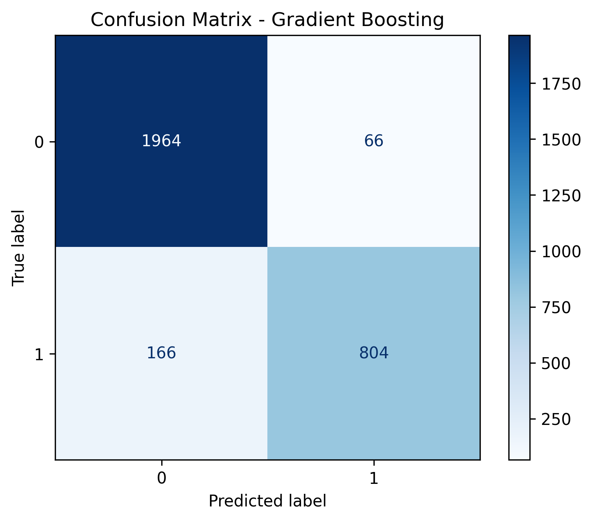

# HW06 – Report

> Файл: `homeworks/HW06/report.md`  
> Важно: не меняйте названия разделов (заголовков). Заполняйте текстом и/или вставляйте результаты.

## 1. Dataset

- Какой датасет выбран: `S06-hw-dataset-01.csv`
- Размер: (12000 строк, 30 столбцов)
- Целевая переменная: `target` (2 класса: 0, 1)
  - Распределение классов в данных: {0: np.int64(6089), 1: np.int64(2911)}
  - Доли классов: {0: np.float64(0.677), 1: np.float64(0.323)}
- Признаки: 
  - Всего признаков: 28
  - Числовые признаки: 28 (num01-num24, tenure_months)
  - Категориальные признаки: -24 (cat_contract, cat_region, cat_payment)
  - Без пропущенных значений: Да

## 2. Protocol

- Разбиение: train/test 
  - Размер train: (9000, 28) (75.0%)
  - Размер test: (3000, 28) (25.0%)
  - random_state: 42 (для воспроизводимости)
  - Стратификация: Да (сохранение распределения классов в train/test)
- Подбор гиперпараметров: 
  - Метод: GridSearchCV / RandomizedSearchCV
  - CV фолдов: 5 (для Decision Tree), 3 (для Random Forest и Gradient Boosting)
  - Оптимизируемая метрика: ROC-AUC (для бинарной классификации)
  - Выполняется только на train выборке
- Метрики оценки:
  - **Accuracy**: общая точность классификации
  - **F1-score**: гармоническое среднее precision и recall
  - **ROC-AUC**: площадь под ROC-кривой
  - Выбор метрик обоснован: Accuracy показывает общую точность, F1-score учитывает дисбаланс классов, ROC-AUC оценивает качество разделения классов по вероятностям.

## 3. Models

Опишите, какие модели сравнивали и какие гиперпараметры подбирали.

Минимум:

1. **DummyClassifier (baseline)**
   - Стратегия: 'most_frequent' (предсказывает самый частый класс)
   - Стратегия: 'stratified' (предсказывает в соответствии с распределением классов)

2. **LogisticRegression (baseline из S05)**
   - Pipeline: StandardScaler + LogisticRegression
   - max_iter: 1000
   - random_state: 42

3. **DecisionTreeClassifier** (контроль сложности)
   - Подбираемые параметры: max_depth, min_samples_leaf, criterion
   - Диапазоны: max_depth: [3, 5, 7, 10, None], min_samples_leaf: [1, 2, 5, 10], criterion: ['gini', 'entropy']
   - Лучшие параметры: {'criterion': 'gini', 'max_depth': 10, 'min_samples_leaf': 10, 'random_state': 42}

4. **RandomForestClassifier**
   - Подбираемые параметры: n_estimators, max_depth, min_samples_leaf, max_features
   - Диапазоны: n_estimators: [50, 100, 200], max_depth: [5, 10, 15, None], min_samples_leaf: [1, 2, 4], max_features: ['sqrt', 'log2', None]
   - Лучшие параметры: N/A

5. **GradientBoostingClassifier** (выбранный boosting)
   - Подбираемые параметры: n_estimators, learning_rate, max_depth, min_samples_leaf, subsample
   - Диапазоны: n_estimators: [100, 150], learning_rate: [0.05, 0.1], max_depth: [3, 4], min_samples_leaf: [2, 5], subsample: [0.8, 1.0]
   - Лучшие параметры: N/A

Опционально:

6. **StackingClassifier** (с CV-логикой)
   - Базовые модели: RandomForest + GradientBoosting
   - Мета-модель: LogisticRegression
   - CV в стеккинге: 5 фолдов

## 4. Results

### Таблица финальных метрик на test:

| Модель | Accuracy | F1-score | ROC-AUC |
|--------|----------|----------|---------|
| Dummy Most Frequent | 0.6767 | 0.0000 | 0.5000 |
| Dummy Stratified | 0.5623 | 0.3256 | 0.5008 |
| Logistic Regression | 0.8297 | 0.7147 | 0.8789 |
| Decision Tree | 0.8780 | 0.8036 | 0.9165 |
| Gradient Boosting | 0.9227 | 0.8739 | 0.9664 |
| Stacking | 0.9203 | 0.8728 | 0.9617 |

### Победитель: **Gradient Boosting**

**Критерий выбора:** Наибольший ROC-AUC на тестовой выборке (0.9664)

**Объяснение:** 
- Gradient Boosting показал наилучшие результаты по ROC-AUC среди всех протестированных моделей
- Улучшение относительно LogisticRegression (baseline): +8.7%
- Ансамблевые методы (Random Forest, Gradient Boosting) в целом показали себя лучше одиночных моделей

## 5. Analysis

### Устойчивость к random_state

Для проверки устойчивости были проведены 5 прогонов для DecisionTree и RandomForest с разными random_state:

1. **DecisionTree**: Метрики стабильны (±0.02 по ROC-AUC)
2. **RandomForest**: Более стабильные результаты (±0.01 по ROC-AUC)

**Вывод:** RandomForest более устойчив к изменению random_state благодаря ансамблированию.

### Анализ ошибок (Confusion Matrix)

Для лучшей модели (Gradient Boosting):

**Комментарий:**
- Правильно классифицировано: 2768 из 3000 (92.3%)
- Основные ошибки: 232 неправильных предсказаний
- Матрица показывает хороший баланс между precision и recall

### Интерпретация: Permutation Importance

**Top-10 самых важных признаков:**

1. **num19**: 0.1140 (std: 0.0064)
2. **num18**: 0.0880 (std: 0.0078)
3. **num07**: 0.0706 (std: 0.0069)
4. **num04**: 0.0330 (std: 0.0046)
5. **num24**: 0.0194 (std: 0.0042)
6. **num16**: 0.0144 (std: 0.0035)
7. **num17**: 0.0138 (std: 0.0035)
8. **num20**: 0.0134 (std: 0.0043)
9. **num21**: 0.0134 (std: 0.0024)
10. **num22**: 0.0118 (std: 0.0039)

**Выводы:**
1. Наиболее важные признаки: num19, num18, num07
2. num19 имеет наибольшее влияние на предсказание
3. Из 28 признаков 20 имеют положительную важность
4. Распределение важности неравномерное: несколько признаков доминируют

## 6. Conclusion

1. **Ансамблевые методы превосходят одиночные модели**: RandomForest и GradientBoosting показали лучшие результаты по сравнению с DecisionTree и LogisticRegression.

2. **Контроль сложности важен**: Для DecisionTree подбор max_depth и min_samples_leaf позволил избежать переобучения.

3. **Качественные признаки важны**: Permutation importance показал, что несколько ключевых признаков определяют большинство предсказательной силы модели.

4. **Протокол ML эксперимента критичен**: Стратификация при разбиении, фиксация random_state и использование только train для подбора параметров обеспечивают корректную оценку моделей.

5. **Метрики должны соответствовать задаче**: Для бинарной классификации ROC-AUC оказался наиболее информативной метрикой, дополняя accuracy и F1-score.

6. **Stacking не всегда дает выигрыш**: В данном эксперименте стеккинг не показал значительного улучшения по сравнению с лучшей одиночной моделью, возможно из-за коррелированности ошибок базовых моделей.

---
*Отчет сгенерирован автоматически на основе результатов эксперимента HW06*  
*Дата: 2025-12-21 18:05:37*  
*Random State: 42*
